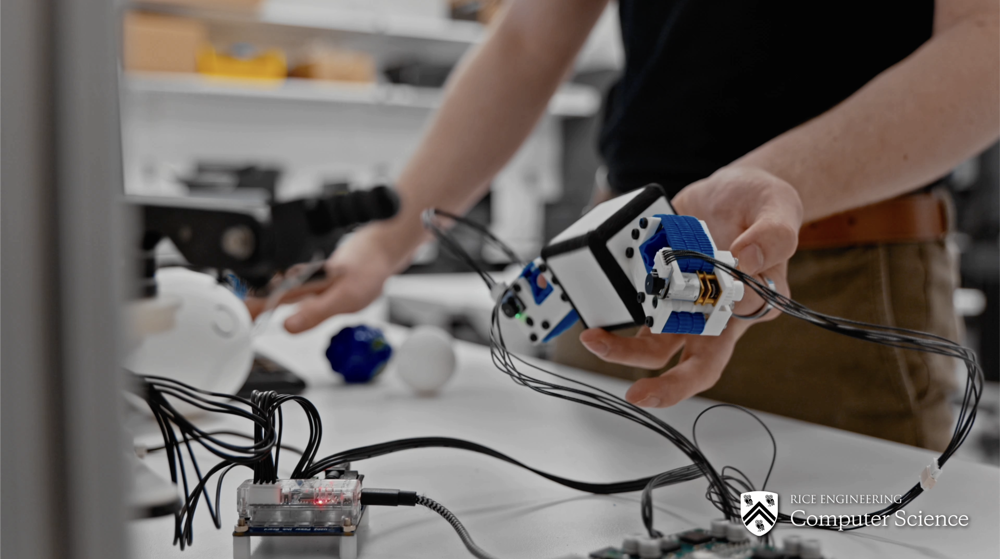

# Roller Ring - Modular, Wearable In-hand Manipulator


This repository covers the CAD files, software, and instructions needed to operate the <ins>**Roller Ring**</ins>. The Roller Ring is a low-cost modular robotic attachment with active surfaces, that is wearable by both robot and human hands, to manipulate objects without lifting a finger. To create these movements, we developed and implemented a generalized motion model for active surfaces to manipulate arbitrary object shapes through non-holonomic object motions. To see further discussion of this device's physical capabilities and ideas behind it, please see the associated [research paper](https://arxiv.org/abs/2403.13132) which has been published in the [2025 IEEE/RSJ International Conference on Intelligent Robots and Systems (IROS 2025)](https://www.iros25.org) and won 3rd Place at the [ASME Student Mechanism and Robot Design Competition](https://sites.google.com/site/asmemrc/design-competition-showcase/2024-finalists?authuser=0). For device licensing, commerical use, or future collaboration of the Roller Ring, please contact [<ins>**Hayden Webb**</ins>](hw846@cornell.edu) and/or [<ins>**Kaiyu Hang**</ins>](kaiyu.hang@rice.edu). <br>

<p align="center">
  <a href="https://youtu.be/WcgoPhGvVFQ?si=lwNhkjuWtoK7LcqY">
    
  </a>
</p>

<p align="center">
    <u><b>Promotional Video</b></u>
</p>
<br>


<p align="center">
    <u><b>Manipulation Capabilities</b></u>
</p>

## Hardware
In **hardware** you'll find the STL files for printing the Roller Rings using an FDM Printer (Bambu, Prusa, etc.). Full Bill of Materials for non 3D-printed components can be found in the Bill of Materials under **BOM_mechanical.xlsx**. Video instruction for mechanical construction can be found below. <br>

<p align="center">
  <a href="https://www.youtube.com/watch?v=R2PSydqvgRo">
    
  </a>
</p>
<p align="center">
    <u><b>Construction Video</b></u>
</p>

## Software
In **software**, you'll find the teleoperation script for controlling the Roller Rings. In this, options for using either a keyboard or game controller for teleoperation is provided. For full documentation and origin of Teensy motor script & board utilized in teleoperation, please refer to the README found in this folder. The board and motor-related components can be found in the Bill of Materials under **BOM_electrical.xlsx** . <br>

For further questions and inquiries regarding the software and PCB detailed here, please contact [Shenli Yuan](https://yuanshenli.com/). <br>


## Citation
If this project has helped you in your projects, you can cite this work with:

```bibtex
@inproceedings{2403.13132,
    Author = {Hayden Webb and Podshara Chanrungmaneekul and Shenli Yuan and Kaiyu Hang},
    booktitle = {2025 IEEE/RSJ International Conference on Intelligent Robots and Systems (IROS)},
    Title = {Wearable Roller Rings to Augment In-Hand Manipulation through Active Surfaces},
    Year = {2025},
    Volume = {},
    Number = {},
    Pages = {},
    keywords = {In-Hand Manipulation; Multifingered Hands},
    doi = {},
    Eprint = {arXiv:2403.13132}
}
```

## Patent
Further information detailing this work's patent information titled "Wearable roller rings to enable robot dexterous in-hand manipulation through active surfaces" can be found [here](https://patents.google.com/patent/US20260008186A1/en) from the USPTO.